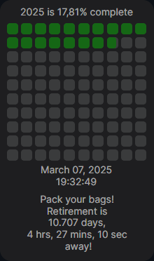
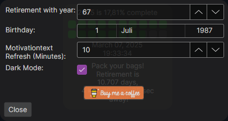

# Year In Progress – Year & Retirement Countdown

## Overview
Year In Progress is a simple yet effective desktop application designed to keep you motivated throughout the year.
It displays the current year's progress in days and provides a real-time countdown to retirement.

The app also features dynamic ***motivational messages*** to keep you going!

## Features
- Made with **AvaloniaUI** and **.NET 9.0**.
- **Year Progress Tracker** – Displays how much of the current year has passed in days.
- **Retirement Countdown** – Shows the exact time left until retirement in days, hours, minutes, and seconds.
- **Dynamic Motivational Messages** – Generates engaging and uplifting messages to keep you motivated.
- **Simple and Intuitive UI** – Easy to use with a clean and minimalistic design.
- **Lightweight & Fast** – Runs smoothly without consuming many resources.
- Autostart option for Windows OS.
- Everything optional, adjust to your liking.

## Screenshots

## Contributing
Contributions are welcome! Feel free to submit issues or pull requests.

## License
This project is licensed under the [MIT License](LICENSE.txt).

## Acknowledgments
Thanks for checking out Year In Progress! Stay inspired and keep pushing forward!

